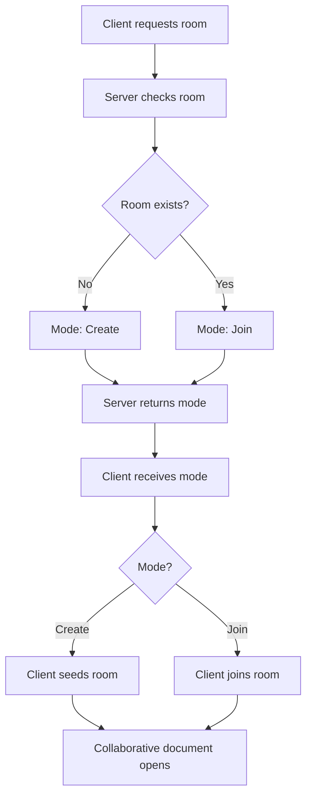

# SuperDoc collaboration v2 demo

This is a minimal SuperDoc v2 collaboration client with a Hocuspocus server.



```sh
pnpm install --ignore-workspace
pnpm --ignore-workspace dev
```

Open <http://localhost:3100> to create a blank room named **untitled document**.
The room ID appears in the URL as `/room/:roomId`. Open that URL directly in
another browser to join the room.

For deployment, set `VITE_COLLAB_URL` to the public `wss://` collaboration URL.

The room is not persisted and disappears when the server stops.

To serve the production build and collaboration server from one Fastify origin:

```sh
pnpm --ignore-workspace build
pnpm --ignore-workspace start
```
